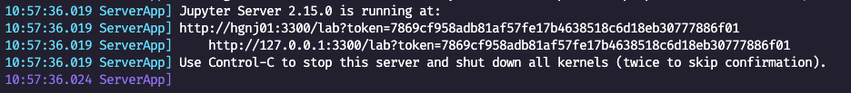

# Sdialog Tutorials :sunglasses:
:point_right: [](http://colab.research.google.com/github/Play-Your-Part/tutorials/)


> _(the content of this folder is a modified version of the tutorials prepared for JSALT 2025 available [here](https://github.com/Play-Your-Part/tutorials))_
---

## Getting started

> ⚠️ **NOTE:**
> If you have **no access to compute**, click on the "Open In Colab" badge above and ignore this README. If you do have access to compute with GPU, then you can proceed.

Tutorials have only **one** requirement: Apptainer. So, make sure you have installed [Apptainer](https://apptainer.org/docs/user/main/introduction.html) on your machine.

Once you have Apptainer running, the only thing needed is to download our Apptainer `jsalt.sif` file from HuggingFace by clicking [here](https://huggingface.co/Play-Your-Part/tutorials-apptainer-sif-file/resolve/main/jsalt.sif).
This file contains everything we need inside.

Finally, let's check if our Apptainer is working:
_(if you have a cluster, don't forget to connect to a node with GPU first, e.g. `salloc -A YOUR_USER -p gpu -t 08:00:00 --gpus rtx3090:1`)_
```bash
apptainer run --nv jsalt.sif
```
You should see you're now connected to `Apptainer>` in the terminal.
If we do:
```
ls -lh
```
We see the apptainer by default does not have access to the host current direction (the content of the `tutorials` folder).
Let's close it with Ctrl+D and call run but with the `-H` flag to set the apptainer home directorey to the host current directory:

```bash
cd to/your/tutorials

apptainer run -H $(pwd) --nv jsalt.sif

ls -lh
```
Now we should see all our tutorial files.

> **Note:** alternatively to downloading the `.sif` file, you can built it from scratch, for instance using Slurm with:
> ```
> sbatch apptainer_build.sbatch
> ```
> You should first update the `.sbatch` file to match your credentials and computing, etc.


Let's try now try using gemma3-1b model with ollama, once connected to our apptainer:

> (optional) change default ollama `~/.ollama/models` folder to store the models to locally in our current tutorials folder:
> ```bash
> export APPTAINERENV_OLLAMA_MODELS="$(pwd)/.ollama/models"
> ```

```bash
ollama serve &
ollama run qwen2.5:14b

>>> What model are you?
```
> I’m Gemma, a large language model created by the Gemma team at Google DeepMind.
> I’m an open-weights model, which means I’m widely available for public use!

> ⚠️ In case you're getting **x509: certificate signed by unknown authority** when ollama tries to download the model via HTTPS, make sure to set the `SSL_CERT_FILE` environment variable to point to the certificate files, for example:
> _(from outside the apptainer)_
>```bash 
> export APPTAINERENV_SSL_CERT_FILE=/usr/lib/ssl/certs/ca-certificates.crt
> ```

Pres Ctrl+D to close the chat.
Let's try the following piece of Python code that uses [LangChain](https://github.com/langchain-ai/langchain) to interact with our [ollama](https://github.com/ollama/ollama) models.
Type `python3` and paste the following code:

```python
from langchain_ollama.chat_models import ChatOllama
llm = ChatOllama(model="qwen2.5:14b", temperature=0)
response = llm.invoke([
    ("system", "You are the best japanese translator in the world."
               "Translate the user sentence to casual japanese without explanations."),
    ("human", "I love JSALT workshop :)")
])
print(response.content)
```
> JSALTワークショップ大好きです

Great! 😊 everything is working fine! we just need to download the dataset and that's it.

### Dataset Preparation

```bash
cd datasets
git clone git@github.com:RasaHQ/STAR.git
```
Make sure you end up with the STAR dataset in `datasets/STAR` with `dialogues` and `tasks` folders inside.
> ⚠️ If you're getting an error message, clone STAR from outside the Apptainer inside the `datasets` folder.

## Jupyter Notebook

Run the Jupyter server inside the apptainer first:

```bash
apptainer run -H $(pwd) --nv jsalt.sif

exec jupyter lab --no-browser --ip 0.0.0.0 --port 3300
```

And then copy the URL that was printed when running the Server including the token value. For instance, for the following log:



The url is the following:
```
http://127.0.0.1:3300/lab?token=7869cf958adb81af57fe17b4638518c6d18eb30777886f01
```

You can then paste this URL directly in your browser to get access to the notebooks.

> **Note:** If you're running apptainer in a remote node, we will need to use SSH port forwaring/tunneling. In your host machine run:
> 
> ```bash
> ssh -N -L 3300:localhost:3300 NODE_NAME
> ```

You can connect using VS code too, instead of your browser, make sure you have the Jupyter extension installed. Then in VS Code, click on [connect to server](https://code.visualstudio.com/docs/datascience/jupyter-kernel-management#_existing-jupyter-server) and paste the Jupyter server URL to connect.

We're going to use Ollama in our tutorials, and we can run Ollama server inside a cell by doing the following "trick" to allow running background processes within a cell:

```python
import os
get_ipython().system = os.system  # <- little hack

!ollama serve &
```
Note: the first two lines are a simple hack to allow running background processes (e.g. "`ollama serve &`") inside the notebook.

---

### Run my python script from outside the apptainer?

Another option is to use the Apptainer `exec` command to run the python script directly from outside the apptainer.
Press Ctrl+D to close our apptainer. Now try running the `test_chatollama.py` as follows:
```bash
# in some environemnt D-Bus session bus (IPC) creates errors
# when running an apptainer instance, so, in case of errors,
# we can disable it with:
# unset DBUS_SESSION_BUS_ADDRESS

apptainer instance start --nv jsalt.sif jsalt
apptainer exec instance://jsalt ollama serve &

# run all the scripts we want to
apptainer exec instance://jsalt python3 test_chatollama.py

# once finished, we can stop the background instance
apptainer instance stop jsalt
```
> JSALTワークショップ大好きです

## Unable to use Apptainer?

Just make sure that you have ollama installed and the `requerements.txt`, that is, make sure you run (for instance inside a new conda environment):
```bash
curl -fsSL https://ollama.com/install.sh | sh
pip install -r requirements.txt
```
If you have access to GPU, make sure your environment have CUDA installed.

If your are running the tutorials on Google Colab, just click [here](http://colab.research.google.com/github/Play-Your-Part/tutorials/).

That's it. Good luck! :)
